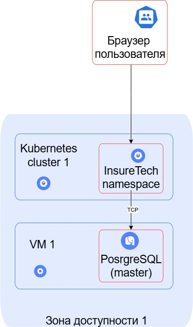
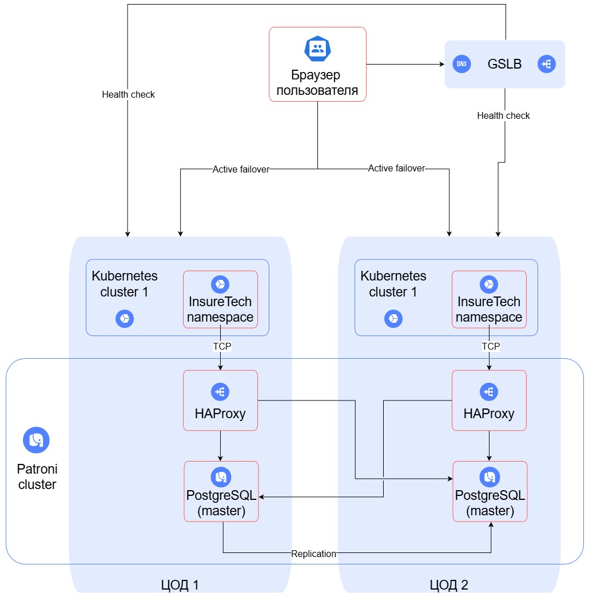

## Задание 1. Проектирование технологической архитектуры

### Текущая архитектура

### Требования к разрабатываемой системе

- RTO (Recovery Time Objective, целевое время восстановления) — 45 мин.;
- RPO (Recovery Point Objective, целевая точка восстановления) — 15 мин.;
- доступность приложения равна 99,9%;
- обеспечить одинаковое время загрузки страниц для пользователей из разных регионов

### Поиск решения

Основная стратегия масштабирования - горизонтальное масштабирование. Увеличение ресурсов существующих серверов - временное и дорогое решение.

Поскольку требования к доступности системы крайне высокие, следует использовать георезервирование с Active-Active. Георезервирование защищает от региональных сбоев. Active-Active позволяет всем узлам обрабатывать запросы одновременно, обеспечивая минимальное время простоя и соответствие требованиям доступности. Улучшается отклик приложения благодаря равномерному распределению нагрузки. При такой стратегии систему проще горизонтально масштабировать.

При георезервировании возникает вопрос маршрутизации трафика за пределами одной площадки. Для решения этой проблемы максимально эффективным инструментом считается GSLB (Global Server Load Balancer). На балансировщике нужно будет настроить rate limit 20 RPS для определенных клиентов.

При развертывании приложения в Kubernetes будем использовать независимые кластеры, они более отказоустойчивы и проще в управлении. Растянутый кластер приведет к дополнительной задержке при взаимодействии нодов из разных ЦОД.

Для БД используется Patroni. Узлы БД находятся на разных ЦОД для более высокой отказоустойчивости.

На текущий момент (объем данных 50GB) шардирование базы данных будет избыточным

### Целевая архитектура

