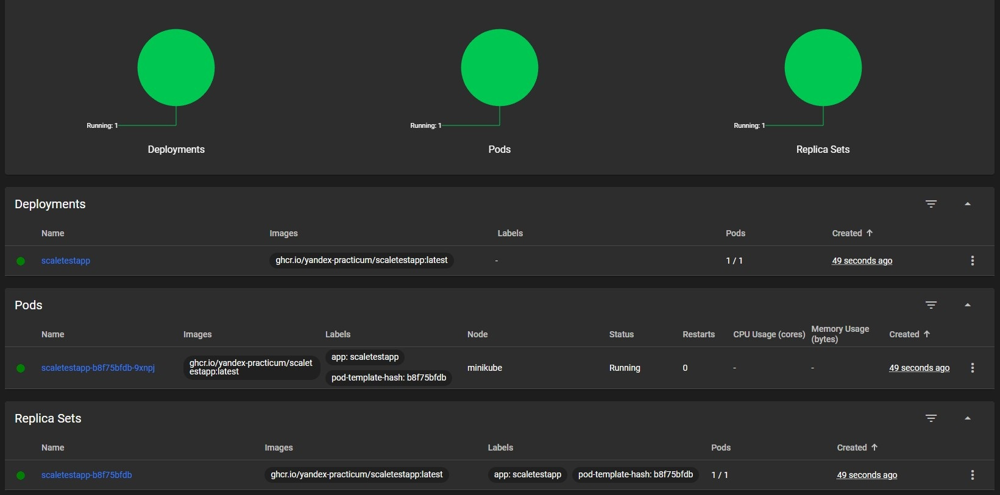
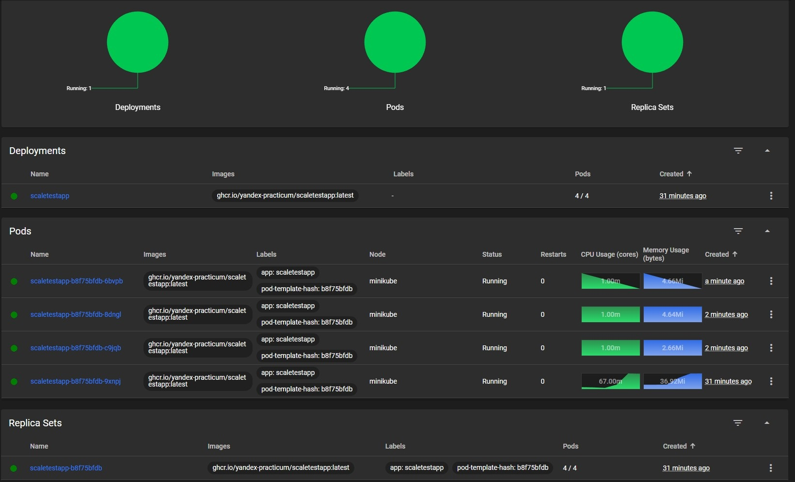

## Задание 2. Динамическое масштабирование контейнеров

### Запуск на Windows 11

Установить и запустить Docker Desktop.

Установить minikube (например, с помощью Chocolatey).

Поднять локальный кластер Kubernetes в Minikube:

```
minikube start
```

Активировать metrics-server:

```
minikube addons enable metrics-server
```

Создать неймспейс:

```
kubectl create namespace sprint8
```

Установка locust (необходимо выполнять из директории Task2)

```
pip install locust
```

Применить манифесты. В директории Task2 выполнить команды:

```
kubectl apply -f deployment.yaml
kubectl apply -f service.yaml
kubectl apply -f hpa.yaml
```

Проброс портов:

```
kubectl port-forward svc/scaletestapp-svc 8080:8080
```

Запуск locust (необходимо выполнять из директории Task2):

```
locust
```

После запуска Locust открыть веб-браузер и ввести адрес http://localhost:8089. В веб-интерфейсе Locust можно настроить параметры теста: количество пользователей и hatch rate — скорость, с которой генерируются новые пользователи

Открыть дашборд Kubernetes:

```
minikube dashboard
```

Без нагрузки:



Под нагрузкой:


