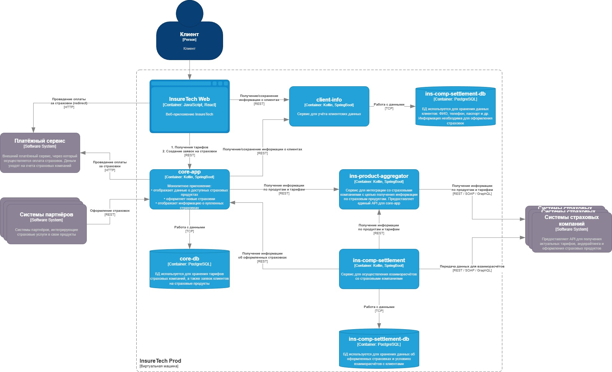
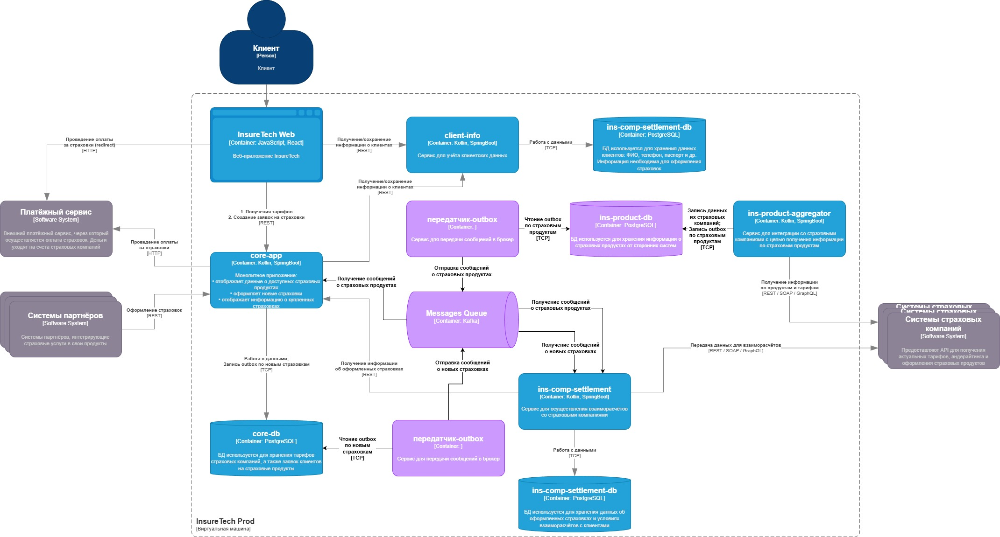

## Задание 3. Переход на Event-Driven архитектуру

### Краткое описание текущих потоков
- core-app и ins-comp-settlement получают продукты и тарифы через REST у ins-product-aggregator.
- ins-product-aggregator при каждом запросе синхронно вызывает 5 страховых компаний, агрегирует ответы и возвращает результат.
- локальные копии продуктов/тарифов хранятся:
  - в core-app - обновление раз в 15 минут;
  - в ins-comp-settlement - обновление раз в сутки.
- дополнительно ins-comp-settlement раз в сутки обращается в core-app по REST API, чтобы получить список оформленных за день страховок.

### Список проблем и рисков, связанных с увеличением числа страховых компаний

- При увеличении количества страховых компаний пропорционально возрастет время агрегированного ответа, усложнится поддержание консистентности данных и обработка ошибок.
- Устаревшие данные о продуктах между обновлениями.
- Сбой при получении данных из одного поставщика данных страховых компаний может привести к ошибке или к блокированию агрегации.
- Возможна рассинхронизация полученных данных сервисами core-app и ins-comp-settlement, так как различается частота запросов данных.

### Предлагаемое решение

Предлагается перевести взаимодействие сервисов полностью на асинхронное.
1. ins-comp-aggregator по расписанию параллельно опрашивает страховые компании, применяя retry с паузой в случае сбоя. Применется паттерн Transactional Outbox. Результат каждого опроса страховой компании фиксируется в БД агрегатора, в этой же транзакции сохраняется запись в outbox-таблицу. Отдельный процесс читает outbox-таблицу и отправляет сообщения брокеру сообщений. core-app и ins-comp-settlement подписываются на события брокера, получают и сохраняют данные для дальнейшей обработки по мере их поступления.
2. В core-app необходимо применить паттерн Transactional Outbox при оформлении страховки. core-app сначала сохраняет сообщение о новой страховке в базе данных как часть той же транзакции, что обновляет сущность данных. Затем отдельный процесс отправляет сообщения брокеру сообщений. ins-comp-settlement подписывается на события брокера. Таким образом, ins-comp-settlement больше не зависит от REST API core-app, а Transactional Outbox гарантирует, что данные не будут утеряны.

