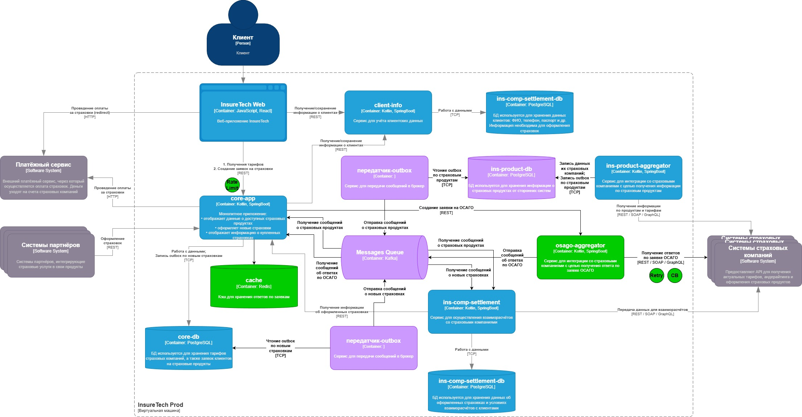

## Задание 4. Проектирование продажи ОСАГО

1. Веб-приложение отправляет запросы в core-app по REST API.

2. Обращения к core-app будут проходить через Rate Limiter. Его задача — осуществлять контроль количества запросов, то есть нагрузку, с которой пользователи или другие системы обращаются к ресурсу.

3. osago-aggregator предоставляет REST API для сервиса core-app с эндпоинтом для создания заявки на ОСАГО.

4. Сервис osago-aggregator возвращает core-app ответы по заявкам в виде сообщений через брокер сообщений (Kafka).

5. Возможно, стоит предусмотреть кэш для ответов по заявкам. В случае, если клиент с небольшой разницей во времени оставит две одинаковые заявки, для второй данные отдадутся из кэша, а не из osago-aggregator.

6. Запросы к внешним сервисам желательно снабдить паттернами Retry и Circuit Breaker.
Когда происходит сбой, паттерн Retry может выполнить несколько повторных попыток с определенной задержкой.
Если после нескольких повторов сбой сохраняется, Circuit Breaker переходит в состояние "открыто" и блокирует все последующие запросы на определенное время. Это предотвращает трату ресурсов на отправку запросов к сервису, который, вероятно, все еще не работает.
Когда Circuit Breaker находится в состоянии "полуоткрыто", он позволяет отправить одну тестовую попытку. Если она успешна, цепь "закрывается", и система возвращается к нормальному режиму работы. Если нет, она остается в состоянии "открыто"

